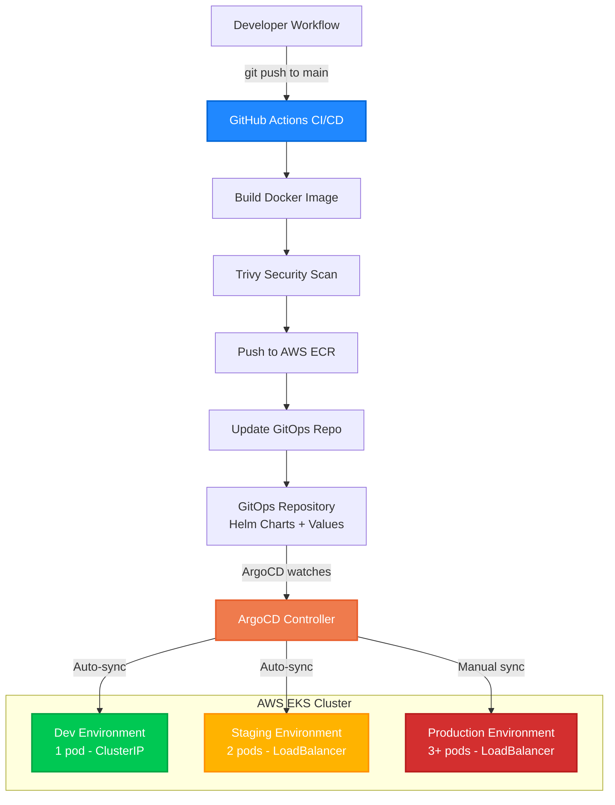

# ✅ Todo App – Enterprise CI/CD Pipeline with GitOps

[](https://github.com/Piyushbajpai11/todo-app-cicd/actions/workflows/ci-cd-pipeline.yml)  
  
  
  
  

A production-ready DevOps project demonstrating **enterprise-grade CI/CD** practices with **Kubernetes (EKS)**, **ArgoCD**, and **GitHub Actions** using a Node.js Todo application.[web:37][web:54]

---

## 🎯 Project Overview

This project implements an end-to-end **CI/CD pipeline** for a Node.js 18 Todo application, showcasing **GitOps**, **Infrastructure as Code**, and **multi-environment deployments** (dev, staging, prod) on AWS.[web:52][web:66]  
Application code lives in this repo, while Kubernetes configuration and environment values live in a separate GitOps repo, following the “app repo vs config repo” separation recommended for GitOps workflows.[web:52][web:64]  

### Key Features

- ✅ Automated CI/CD with **GitHub Actions** (build, test, scan, push, GitOps update)[web:53]  
- ✅ **GitOps deployments** using ArgoCD for declarative, pull-based delivery to EKS[web:52][web:61]  
- ✅ Multi-environment setup: **dev**, **staging**, **prod** with different policies and scaling  
- ✅ Security scanning with **Trivy** integrated into the pipeline[web:53][web:56]  
- ✅ Infrastructure as Code with **eksctl** for EKS cluster provisioning[web:54][web:66]  
- ✅ Container images stored in private **AWS ECR**  
- ✅ **Helm 3** packaging with environment-specific values files in the GitOps repo[web:44]  

---

## 🏗️ Architecture



**Workflow:**
1. Developer pushes code to `main` branch
2. GitHub Actions builds, scans, and pushes Docker image to ECR
3. Pipeline updates `values-dev.yaml` in GitOps repo
4. ArgoCD detects change and auto-syncs dev environment
5. Manual promotion to staging → production with Git commits
6. ArgoCD pulls desired state and applies to Kubernetes cluster

**Key Components:**
- **GitHub Actions**: CI/CD automation
- **AWS ECR**: Private container registry  
- **GitOps Repo**: Single source of truth for deployments
- **ArgoCD**: GitOps controller running in EKS
- **AWS EKS**: Managed Kubernetes cluster with 3 environments

## 🚀 Technology Stack

| Category              | Technologies                             |
|-----------------------|-------------------------------------------|
| Container Orchestration | Kubernetes (AWS EKS)                  |
| GitOps                | ArgoCD                                   |
| CI/CD                 | GitHub Actions                           |
| Container Registry    | AWS ECR                                  |
| Package Manager       | Helm 3                                   |
| Infrastructure        | AWS (EKS, EC2 Spot Instances)            |
| Security Scanning     | Trivy                                    |
| Application Runtime   | Node.js 18                               |

Trivy scans container images during CI and can upload results to the GitHub Security tab for visibility.[web:53][web:56]  

---

## 📁 Project Structure

### Application Repository – `todo-app-cicd`

```bash
todo-app-cicd/
├── .github/
│ └── workflows/
│ └── ci-cd-pipeline.yml # Main CI/CD pipeline
├── src/ # Node.js application source code
├── Dockerfile # Multi-stage Docker build
├── package.json # Dependencies and scripts
└── README.md
```

text

### GitOps Repository – `todo-app-gitops` (Separate Repo)

```bash
todo-app-gitops/
├── helm-charts/
│ └── todo-app/
│ ├── Chart.yaml
│ ├── values.yaml # Default values
│ ├── values-dev.yaml # Dev environment
│ ├── values-staging.yaml # Staging environment
│ ├── values-prod.yaml # Production environment
│ └── templates/
│ ├── deployment.yaml
│ ├── service.yaml
│ └── _helpers.tpl
├── argocd-apps/
│ ├── todo-app-dev.yaml
│ ├── todo-app-staging.yaml
│ └── todo-app-prod.yaml
└── README.md
```

text

This two-repo pattern aligns with GitOps recommendations to keep app code and deployment configuration decoupled.[web:52][web:64]  

---

## 🔄 CI/CD Pipeline Flow

### Automated Pipeline (on push to `main`)

1. **Build Stage**
   - Checkout repository.
   - Build Docker image using a multi-stage Dockerfile.
   - Tag image with:
     - Git commit SHA (e.g. `abc1234`)
     - Semantic version (e.g. `v1.0.5`)
     - Environment tag (e.g. `dev`)
     - `latest`

2. **Security Stage (Trivy)**
   - Run Trivy against the built image.  
   - Optionally upload scan results to **GitHub Security → Code scanning alerts**.[web:53][web:56]  
   - Pipeline continues (non-blocking) while still surfacing vulnerabilities.

3. **Push Stage**
   - Authenticate to AWS ECR using GitHub secrets.  
   - Push tagged images (SHA, version, env, latest) to a private ECR repository.[web:54]  

4. **GitOps Update Stage**
   - Clone `todo-app-gitops`.  
   - Update `values-dev.yaml` (image tag) in the Helm chart.  
   - Commit and push changes back to the GitOps repo.  
   - ArgoCD detects the commit and auto-syncs the **dev** environment.[web:52][web:49]  

### Manual Promotion

**Staging Deployment**

Promote dev build to staging
sed -i 's/tag: ".*"/tag: "v1.0.5"/' helm-charts/todo-app/values-staging.yaml
git commit -am "Promote v1.0.5 to staging"
git push

text

**Production Deployment**

Promote tested version to prod
sed -i 's/tag: ".*"/tag: "v1.0.5"/' helm-charts/todo-app/values-prod.yaml
git commit -am "Promote v1.0.5 to production"
git push

Manually sync production in ArgoCD UI for safety
text

Using Git for promotions provides a full audit trail of every release across environments.[web:52]  

---

## 🛠️ Setup Instructions

### Prerequisites

- AWS account with sufficient IAM permissions  
- **AWS CLI**, **kubectl**, **eksctl**, **helm**, **Docker** installed locally[web:54][web:66]  
- GitHub account and repositories:
  - `todo-app-cicd` (this repo)
  - `todo-app-gitops` (GitOps repo)

### 1. Clone Repositories

git clone https://github.com/Piyushbajpai11/todo-app-cicd.git
git clone https://github.com/Piyushbajpai11/todo-app-gitops.git

text

### 2. Create EKS Cluster

eksctl create cluster -f eks-cluster-config.yaml

text

Using a config file lets you capture node groups, instance types, and networking as code for repeatable cluster provisioning.[web:54][web:63]  

### 3. Install ArgoCD

kubectl create namespace argocd
kubectl apply -n argocd -f https://raw.githubusercontent.com/argoproj/argo-cd/stable/manifests/install.yaml

Expose ArgoCD server
kubectl patch svc argocd-server -n argocd -p '{"spec": {"type": "LoadBalancer"}}'

Retrieve ArgoCD admin password
kubectl -n argocd get secret argocd-initial-admin-secret
-o jsonpath="{.data.password}" | base64 -d

text

ArgoCD acts as the in-cluster GitOps controller, pulling desired state from the GitOps repo and applying it to EKS.[web:49][web:61]  

### 4. Configure GitHub Secrets

In the **todo-app-cicd** GitHub repository, configure:

- `AWS_ACCESS_KEY_ID`  
- `AWS_SECRET_ACCESS_KEY`  
- `AWS_REGION` (e.g. `ap-south-1`)  
- `GITOPS_REPO_TOKEN` – fine-grained PAT with **Contents: Read & Write** for `todo-app-gitops`  

### 5. Create ECR Repository

aws ecr create-repository
--repository-name todo-app
--region ap-south-1

text

### 6. Deploy ArgoCD Applications

kubectl apply -f todo-app-gitops/argocd-apps/

text

This registers the dev, staging, and prod ArgoCD Applications, each wired to its respective values file.

---

## 🔐 Security Features

- **Image Scanning**: Trivy scans Docker images for CVEs before they are promoted.[web:53][web:56]  
- **Least Privilege**: EKS worker nodes use IAM roles scoped to only required AWS services.[web:54]  
- **Private Registry**: All images are stored in private AWS ECR repositories.  
- **Network Policies**: Kubernetes NetworkPolicies can restrict traffic between namespaces and services.  
- **Secrets Management**: Kubernetes Secrets store ECR credentials and other sensitive data.  
- **Manual Prod Approval**: Production sync in ArgoCD is manual, adding a strong safety gate.[web:61]  

---

## 💰 Cost Optimization

- **Spot Instances**: Use EC2 Spot instances for worker nodes to reduce compute costs by up to ~70%.[web:57]  
- **Right-Sizing**: Choose instance types like `t3.medium` for balanced CPU/memory usage.[web:54]  
- **Auto-Scaling**: HPA configured for production with min/max pod counts per load profile.  
- **Resource Limits**: CPU and memory limits per environment to avoid noisy-neighbor issues.  

Approximate monthly cost for a small non-critical cluster can be in the **$90–100** range, depending on AWS pricing and actual usage.[web:54][web:57]  

---

## 📊 Monitoring & Observability

- **ArgoCD UI** for deployment status, health, and sync history[web:49]  
- **GitHub Actions** UI for CI/CD logs and Trivy scan results[web:53]  
- **kubectl** for pod logs, events, and cluster troubleshooting  
- **AWS CloudWatch** (optional) for EKS logs and metrics integration[web:60]  

---

## 🎓 Learning Outcomes

This project demonstrates:

- ✅ Practical GitOps with ArgoCD and separate config repo[web:52][web:64]  
- ✅ CI/CD pipeline design with GitHub Actions  
- ✅ Secure container image workflows with Trivy and ECR[web:53][web:56]  
- ✅ Multi-environment delivery strategy on Kubernetes  
- ✅ Infrastructure as Code for EKS clusters with eksctl[web:54][web:66]  
- ✅ Cost-aware cluster design using Spot instances and autoscaling[web:57]  

---

## 🔗 Related Repositories

- **GitOps Repository:** https://github.com/Piyushbajpai11/todo-app-gitops  
- **Application Repository (this repo):** https://github.com/Piyushbajpai11/todo-app-cicd  

---

## 📝 Future Enhancements

- Add **Prometheus + Grafana** dashboards for metrics and alerting  
- Implement **blue-green** and **canary** deployment strategies via ArgoCD[web:55]  
- Add automated rollback on health check failures  
- Integrate Slack / Teams notifications for pipeline and deployment events  
- Extend test coverage with integration and e2e tests  
- Introduce **Istio** or another service mesh for advanced traffic management  
- Add centralized logging (e.g. **ELK** or **OpenSearch**)  

---

## 👤 Author

**Piyush Bajpai**  
GitHub: [@Piyushbajpai11](https://github.com/Piyushbajpai11)  
LinkedIn: *Add your LinkedIn profile URL here*  

---

## 📄 License

This project is open source and available under the **MIT License** (see [`LICENSE`](LICENSE)).  

⭐ If you find this project helpful, consider giving it a star to support the work!